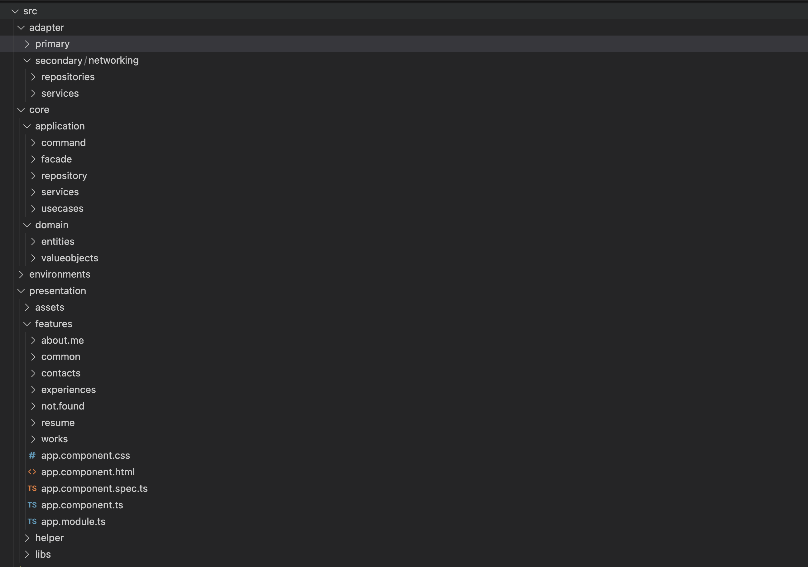
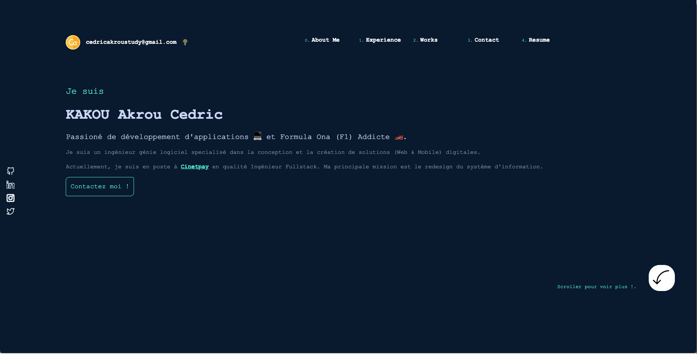
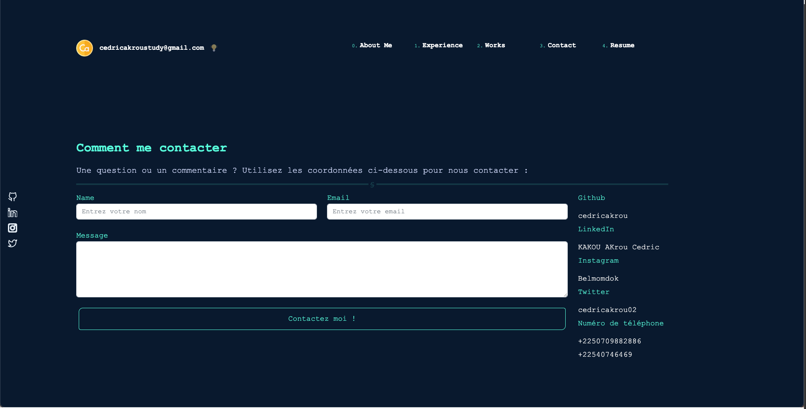

# cedricakrou.com

Presentations, projects, experiences, contacts and Cv.

This project was generated with [Angular CLI](https://github.com/angular/angular-cli) version 14.2.7.

## Development server

Run `ng serve` for a dev server. Navigate to `http://localhost:4200/`. The application will automatically reload if you change any of the source files.

## Code Architecture

This application was built in the [Clean Architecture](https://www.codeguru.com/csharp/understanding-onion-architecture/) and multiples components.

## Structure of files

## Screnshots

In below you will see some screenshots of the application

